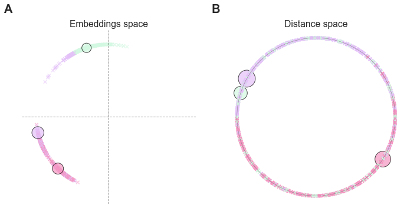

# SiMCa: Sinkhorn Matrix Factorization with Capacity Constraints

[Eric Daoud](https://edaoud.com/)<sup>1,2</sup>,
[Luca Ganassali](https://lganassali.github.io/)<sup>1</sup>,
[Antoine Baker](https://prairie-institute.fr/chairs/antoine-baker/)<sup>1</sup> and
[Marc Lelarge](https://www.di.ens.fr/~lelarge/)<sup>1</sup>

1. INRIA, DI/ENS, Paris, France
2. Institut Curie, Paris, France

This repository contains the code for our paper available on arXiv: https://arxiv.org/abs/2203.10107.

## Abstract

For a very broad range of problems, recommendation algorithms have been increasingly used over the past decade. In most of these algorithms, the predictions are built upon user-item affinity scores which are obtained from  high-dimensional embeddings of items and users. In more complex scenarios, with geometrical or capacity constraints, prediction based on embeddings may not be sufficient and some additional features should be considered in the design of the algorithm.

In this work, we study the recommendation problem in the setting where affinities between users and items are based both on their embeddings in a latent space and on their geographical distance in their underlying euclidean space (e.g., $\mathbb{R}^2$), together with item capacity constraints. This framework is motivated by some real-world applications, for instance in healthcare: the task is to recommend hospitals to patients based on their location, pathology, and hospital capacities. In these applications, there is somewhat of an asymmetry between users and items: items are viewed as static points, their embeddings, capacities and locations constraining the allocation. Upon the observation of an optimal allocation, user embeddings, items capacities, and their positions in their underlying euclidean space, our aim is to recover item embeddings in the latent space; doing so, we are then able to use this estimate e.g. in order to predict future allocations.

We propose an algorithm (SiMCa) based on matrix factorization enhanced with optimal transport steps to model user-item affinities and learn item embeddings from observed data. We then illustrate and discuss the results of such an approach for hospital recommendation on synthetic data.

## Usage

Install the requirements in a virtual environment:

``` bash
virtualenv venv -p python3;
source venv/bin/activate;
pip install -r requirements.txt;
```

Generate a [ToyDataset](./simca/dataset.py) with the following code:

``` python
toy = ToyDataset(
    n_centers=3,       # Gaussian mixture model with k clusters
    n_items=3,         # Number of items
    n_users=1000,      # Number of users
    n_features=2,      # Users features dimension
    distance_weight=0  # Distance weight in the assignment
)
```

The resulting dataset might look like this:



Train the model using the [simca.py](./simca.py) script:

``` bash
PYTHONPATH="." python simca.py
```

The script takes the following parameters:

``` text
usage: simca.py [-h] [--n_centers N_CENTERS] [--n_items N_ITEMS]
                [--n_users N_USERS] [--distance_weight DISTANCE_WEIGHT]
                [--n_features N_FEATURES] [--sinkhorn_n_iter SINKHORN_N_ITER]
                [--sinkhorn_epsilon SINKHORN_EPSILON] [--n_epochs N_EPOCHS]
                [--learning_rate LEARNING_RATE]

SiMCa: Sinkhorn Matrix Factorization with Capacity Constraints

optional arguments:
  -h, --help            show this help message and exit
  --n_centers N_CENTERS
                        Gaussian mixture model with k clusters
  --n_items N_ITEMS     Number of items
  --n_users N_USERS     Number of users
  --distance_weight DISTANCE_WEIGHT
                        Distance vs. affinity relative weight
  --n_features N_FEATURES
                        Users and items embedding dimension
  --sinkhorn_n_iter SINKHORN_N_ITER
                        Number Sinkhorn iterations
  --sinkhorn_epsilon SINKHORN_EPSILON
                        Sinkhorn entropy regularization
  --n_epochs N_EPOCHS   Number of training epochs
  --learning_rate LEARNING_RATE
                        Learning rate
```
