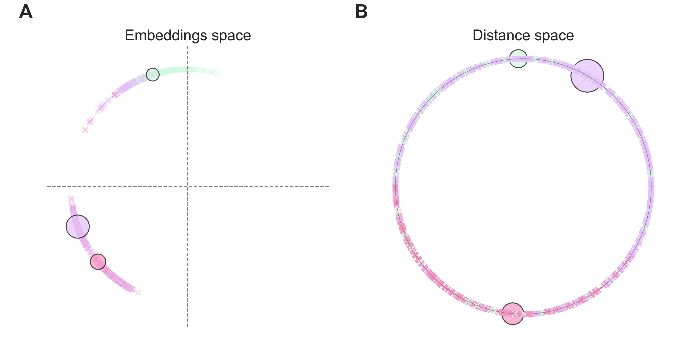
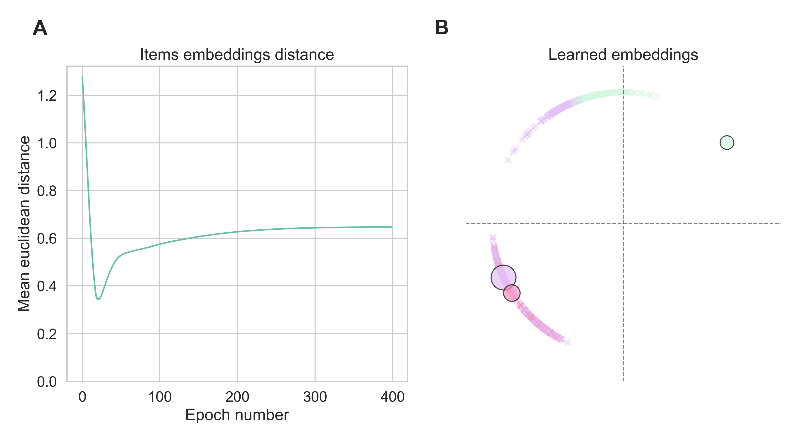

# SiMaC: Sinkhorn Matrix Factorization with Capacity Constraints

<strong>
<a href="https://edaoud.com/">Eric Daoud</a><sup>1,2</sup>,
<a href="https://lganassali.github.io/">Luca Ganassali</a><sup>2</sup>,
<a href="https://www.di.ens.fr/~lelarge/">Marc Lelarge</a><sup>2</sup>,
<a href="https://institut-curie.org/personne/fabien-reyal">Fabien Reyal</a><sup>1</sup>
</strong>

1. Institut Curie, Paris, France
2. INRIA, DI/ENS, Paris, France

## Abstract

For a very broad range of problems, recommendation algorithms have been increasingly used over the past decade. In most of these algorithms, the predictions are built upon user-item affinity scores which are obtained from  high-dimensional embeddings of items and users. In more complex scenarios, with geometrical or capacity constraints, prediction based on embeddings may not be sufficient and some additional features should be considered in the design of the algorithm.

In this work, we study the recommendation problem in the setting where affinities between users and items are based both on their embeddings and on their geographical distance in their underlying euclidean space (e.g., $\mathbb{R}^2$), together with item capacity constraints. This framework is motivated by some real-world applications, for instance in the healthcare sector: the task is to recommend hospitals to patients based on their location, pathology, and hospital capacities. In these applications, there is somewhat an asymmetry between users and items: items are viewed as static points, their embeddings, capacities and locations constraining the allocation. Upon the observation of an optimal allocation, user embeddings, items capacities, and their positions in their underlying euclidean space (which differs from the embedding space), our aim is to recover item positions in the embedding space; doing so, we are then able to use this estimate for instance in order to predict future allocations.

We propose an algorithm based on matrix factorization enhanced with optimal transport steps to model user-item affinities and learn item embeddings from observed data. We then illustrate and discuss the results of such an approach for hospital recommendation on synthetic data.

## Repository structure

- [src](./src): python source code
  - [dataset](./src/dataset/): code for generating the toy dataset.
  - [ml](./src/ml): code for the machine learning model and training functions.
  - [widget](./src/widget): a Flask web application to train the model with various parameters and visualize the results.
  - [utils](./src/utils.py): utilities functions
  - [viz](./src/viz.py): code for the visualizations and paper figures
- [tests](./tests): unit tests
- [notebooks](./notebooks): Jupyter notebooks, that generated the paper results.

## Usage

### Dataset generation

Here is a code snippet to load the [toy dataset](./src/dataset/toy.py), used to train the model.

``` python
from src.dataset.toy import ToyDataset, save_dataset, reload_dataset

# Create a dataset object and generate the data
toy = ToyDataset(
    n_centers=3,  		# number of clusters in Gaussian Mixture Model
    n_features=2, 		# embedding dimension
    n_items=3,    		# number of items
    n_users=1000, 		# number of users
    distance_weight=0 # relative importance of the distance during the generation
)

# Persist the dataset to disk, using pickle
save_dataset(toy, "../data/toy.pkl")

# Load back the saved dataset
toy = load_dataset("../data/toy.pkl")
```

### Training the model

Once the dataset is loaded, we can train the [model](./src/ml/model.py)
with the [`train_model`](./src/ml/train.py) function.

```python
from src.ml.train import train_model

y_pred, model, losses_df, scores_df, capacities_df = train_model(
    toy.users_tensor,
    toy.items_tensor,
    toy.D_tensor,
    y_true_tmp_noised,
    toy.items_capacities,
    toy.items_features,
    n_features=2,  # embedding dimension
    lr=0.01,       # learning rate
    epsilon=0.1,   # entropy regularization
    n_iter=10,     # number of Sinkhorn iterations
    alpha=0.3,     # relative importance of the distance
    n_epochs=200,
    users_features=toy.users_features,
    train_user_embeddings=False # let the model train the users embeddings
)
```

## Example output



<strong>Figure 1: Generated dataset.</strong> Users are displayed as crosses and items as circles, sized proportionally to their capacities. Users are colored accordingly to the item they have been allocated to. Plot (A) displays users and items in their shared embeddings space; where plot (B) displays them in the geographic distance space.



<strong>Figure 2: Training results.</strong> The model achieved to learn the items embeddings and re-create the observed allocations with a 0.93 F1 score. The mean euclidean distance between the learned items embeddings and the ground truth is displayed on plot (A). The items embeddings learned by the model as well as the resulting allocations are displayed on plot (B).
